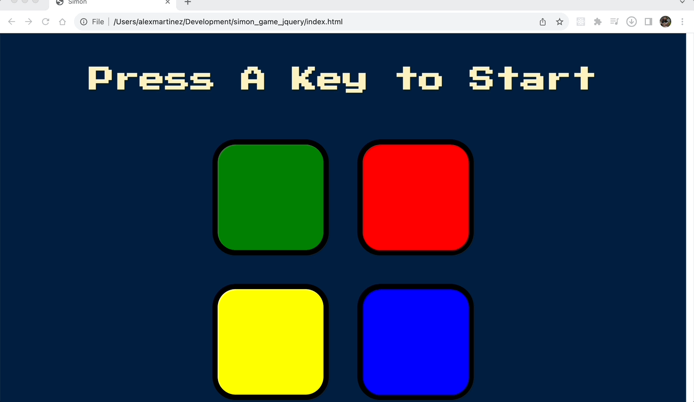

# Simon Game

Welcome to the Simon Game repository! This is a simple implementation of the classic Simon Game using HTML, CSS, and jQuery. The Simon Game is a memory-based pattern matching game that challenges players to repeat increasingly complex sequences of colors and sounds. Test your memory and see how far you can go!

## Demo preview

A quick demo of the game running in the local browser.

## Contributing
Contributions to this project are welcome. If you encounter any issues or have suggestions for improvement, please open an issue on the GitHub repository. Feel free to submit pull requests with new features, bug fixes, or documentation enhancements.

## License
This project is licensed under the MIT License. You are free to use, modify, and distribute the code for both commercial and non-commercial purposes.